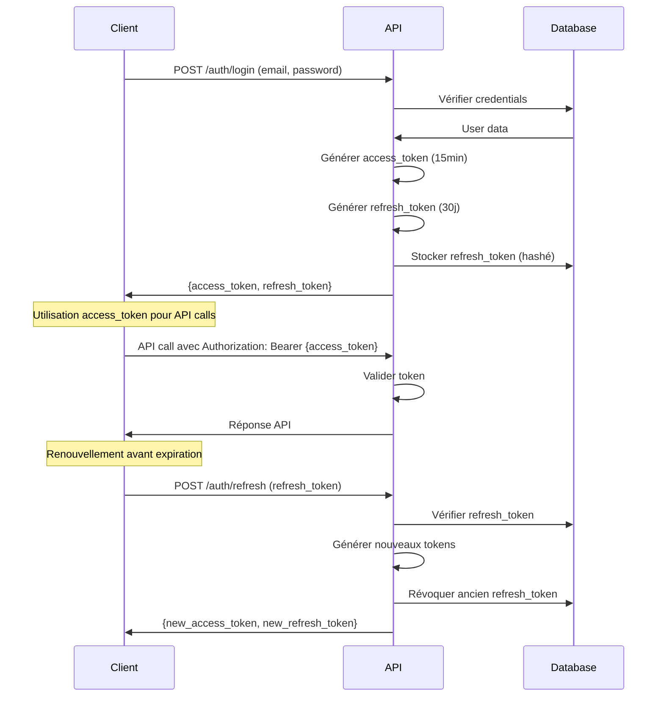

# Documentation API MonAssurance

## Vue d'ensemble

L'API MonAssurance suit les principes REST avec une architecture modulaire et sécurisée.

- **Base URL**: `/api/v1`
- **Authentification**: JWT Bearer tokens
- **Format**: JSON
- **Documentation interactive**: `/docs` (Swagger UI)

## Authentification

### Workflow d'authentification



### Endpoints d'authentification

#### `POST /api/v1/auth/register`
Création d'un nouveau compte utilisateur.

**Request:**
```json
{
  "email": "user@example.com",
  "password": "password123",
  "full_name": "John Doe"
}
```

**Response (201):**
```json
{
  "id": 1,
  "email": "user@example.com",
  "full_name": "John Doe",
  "role": "USER",
  "is_active": true,
  "created_at": "2024-01-15T10:00:00Z"
}
```

#### `POST /api/v1/auth/login`
Connexion utilisateur avec génération de tokens.

**Request:**
```json
{
  "email": "user@example.com",
  "password": "password123",
  "device_label": "iPhone 15"  // Optionnel
}
```

**Response (200):**
```json
{
  "access_token": "eyJ0eXAiOiJKV1QiLCJhbGciOiJIUzI1NiJ9...",
  "refresh_token": "def502004a7b8c...",
  "token_type": "bearer",
  "expires_in": 900,
  "user": {
    "id": 1,
    "email": "user@example.com",
    "role": "USER"
  }
}
```

#### `POST /api/v1/auth/refresh`
Renouvellement des tokens avec rotation.

**Request:**
```json
{
  "refresh_token": "def502004a7b8c..."
}
```

**Response (200):**
```json
{
  "access_token": "eyJ0eXAiOiJKV1QiLCJhbGciOiJIUzI1NiJ9...",
  "refresh_token": "ghi789012b3c4d...",
  "token_type": "bearer",
  "expires_in": 900
}
```

## Gestion des appareils/sessions

#### `GET /api/v1/auth/devices`
Liste des sessions actives de l'utilisateur.

**Headers:**
```
Authorization: Bearer {access_token}
```

**Response (200):**
```json
[
  {
    "id": "abc123",
    "device_label": "iPhone 15",
    "ip_address": "192.168.1.100",
    "user_agent": "Mozilla/5.0 (iPhone; CPU iPhone OS 17_0...",
    "issued_at": "2024-01-15T10:00:00Z",
    "expires_at": "2024-02-14T10:00:00Z",
    "last_used": "2024-01-15T14:30:00Z"
  }
]
```

#### `DELETE /api/v1/auth/devices/{device_id}`
Révocation d'une session spécifique.

**Response (204):** No content

## Clients et polices

### Clients

#### `GET /api/v1/clients`
Liste des clients de l'utilisateur connecté.

**Query Parameters:**
- `skip`: Offset pagination (défaut: 0)
- `limit`: Nombre d'éléments (défaut: 100)

**Response (200):**
```json
{
  "items": [
    {
      "id": 1,
      "name": "Martin Dupont",
      "email": "martin@example.com",
      "phone": "+33123456789",
      "address": "123 Rue de la Paix, 75001 Paris",
      "created_at": "2024-01-15T10:00:00Z",
      "policies_count": 3
    }
  ],
  "total": 50,
  "skip": 0,
  "limit": 100
}
```

#### `POST /api/v1/clients`
Création d'un nouveau client.

**Request:**
```json
{
  "name": "Sophie Martin",
  "email": "sophie@example.com",
  "phone": "+33987654321",
  "address": "456 Avenue des Champs, 75008 Paris"
}
```

**Response (201):** Même structure que GET

### Polices d'assurance

#### `GET /api/v1/policies`
Liste des polices accessibles à l'utilisateur.

**Query Parameters:**
- `client_id`: Filtrer par client
- `company_id`: Filtrer par compagnie
- `status`: Filtrer par statut (active, expired, cancelled)

**Response (200):**
```json
{
  "items": [
    {
      "id": 1,
      "policy_number": "POL-2024-001",
      "client": {
        "id": 1,
        "name": "Martin Dupont"
      },
      "company": {
        "id": 1,
        "name": "AXA France"
      },
      "premium_amount": 1200.00,
      "coverage_amount": 100000.00,
      "start_date": "2024-01-01",
      "end_date": "2024-12-31",
      "status": "active"
    }
  ],
  "total": 25,
  "skip": 0,
  "limit": 100
}
```

## Templates et documents

### Templates

#### `GET /api/v1/templates`
Liste des templates disponibles (MANAGER/ADMIN).

**Query Parameters:**
- `active`: Filtrer par statut (true/false)

**Response (200):**
```json
{
  "items": [
    {
      "id": 1,
      "name": "Contrat Auto Standard",
      "description": "Template pour contrats automobile",
      "is_active": true,
      "versions_count": 3,
      "latest_version": {
        "version": 3,
        "created_at": "2024-01-15T10:00:00Z",
        "file_size": 156789
      }
    }
  ]
}
```

#### `POST /api/v1/templates/{template_id}/versions`
Upload d'une nouvelle version de template.

**Request (multipart/form-data):**
```
file: template.docx
checksum: sha256hash (optionnel)
```

**Response (201):**
```json
{
  "id": 15,
  "template_id": 1,
  "version": 4,
  "file_path": "templates/template_1_v4.docx",
  "file_size": 167892,
  "checksum": "a1b2c3d4e5f6...",
  "created_at": "2024-01-15T10:00:00Z"
}
```

### Génération de documents

#### `POST /api/v1/documents/generate`
Génération d'un document à partir d'un template.

**Request:**
```json
{
  "template_id": 1,
  "template_version": 4,
  "policy_id": 123,
  "format": "pdf",
  "data": {
    "client_name": "Martin Dupont",
    "policy_number": "POL-2024-001",
    "premium": 1200.00
  }
}
```

**Response (201):**
```json
{
  "id": "doc_abc123",
  "status": "pending",
  "download_url": null,
  "created_at": "2024-01-15T10:00:00Z",
  "expires_at": "2024-01-16T10:00:00Z"
}
```

#### `GET /api/v1/documents/{doc_id}/status`
Vérification du statut de génération.

**Response (200):**
```json
{
  "id": "doc_abc123",
  "status": "completed",
  "download_url": "https://api.example.com/api/v1/documents/doc_abc123/download?sig=...",
  "file_size": 89456,
  "created_at": "2024-01-15T10:00:00Z",
  "completed_at": "2024-01-15T10:01:30Z"
}
```

## Administration

### Configuration stockage

#### `GET /api/v1/admin/storage-config`
Récupération de la configuration de stockage (ADMIN).

**Response (200):**
```json
{
  "id": 1,
  "storage_type": "s3",
  "s3_bucket": "monassurance-documents",
  "s3_region": "eu-west-1",
  "s3_access_key_id": "AKIA...",
  "s3_secret_access_key": "[MASKED]",
  "gdrive_folder_id": null,
  "gdrive_service_account_json_path": null,
  "created_at": "2024-01-15T10:00:00Z",
  "updated_at": "2024-01-15T15:30:00Z"
}
```

#### `PUT /api/v1/admin/storage-config`
Mise à jour de la configuration (ADMIN).

**Request:**
```json
{
  "storage_type": "s3",
  "s3_bucket": "new-bucket-name",
  "s3_region": "eu-west-1",
  "s3_access_key_id": "AKIA...",
  "s3_secret_access_key": "secret..."
}
```

### Audit logs

#### `GET /api/v1/admin/audit-logs`
Consultation des logs d'audit (MANAGER/ADMIN).

**Query Parameters:**
- `action`: Filtrer par action
- `object_type`: Type d'objet (User, Policy, Template...)
- `user_id`: Filtrer par utilisateur
- `date_from`: Date début (ISO format)
- `date_to`: Date fin (ISO format)
- `action_contains`: Recherche partielle dans l'action
- `object_contains`: Recherche partielle dans l'objet

**Response (200):**
```json
{
  "items": [
    {
      "id": 1,
      "timestamp": "2024-01-15T10:00:00Z",
      "user_id": 1,
      "user_email": "admin@example.com",
      "action": "CREATE_POLICY",
      "object_type": "Policy",
      "object_id": "123",
      "object_repr": "POL-2024-001",
      "changes": {
        "policy_number": "POL-2024-001",
        "client_id": 1,
        "premium_amount": 1200.00
      },
      "metadata": {
        "ip_address": "192.168.1.100",
        "user_agent": "Mozilla/5.0..."
      }
    }
  ],
  "total": 1250,
  "skip": 0,
  "limit": 100
}
```

#### `GET /api/v1/admin/audit-logs/export`
Export CSV des logs d'audit.

**Query Parameters:** Mêmes filtres que la liste

**Response (200):**
```
Content-Type: text/csv
Content-Disposition: attachment; filename="audit_logs_20240115.csv"

timestamp,user_email,action,object_type,object_repr,changes
2024-01-15T10:00:00Z,admin@example.com,CREATE_POLICY,Policy,POL-2024-001,"{""policy_number"":""POL-2024-001""}"
```

## Système de rapports

### Jobs de rapport

#### `POST /api/v1/reports/dummy`
Lancement d'un rapport de test (ADMIN).

**Request:**
```json
{
  "report_id": "test_report_001"
}
```

**Response (201):**
```json
{
  "job_id": "job_abc123",
  "status": "pending",
  "created_at": "2024-01-15T10:00:00Z"
}
```

#### `GET /api/v1/reports/jobs/{job_id}`
Statut d'un job de rapport.

**Response (200):**
```json
{
  "job_id": "job_abc123",
  "status": "completed",
  "progress": 100,
  "result": {
    "file_path": "/path/to/report.pdf",
    "records_processed": 1250
  },
  "error": null,
  "created_at": "2024-01-15T10:00:00Z",
  "started_at": "2024-01-15T10:00:15Z",
  "completed_at": "2024-01-15T10:02:30Z"
}
```

## Codes d'erreur

### Erreurs d'authentification

| Code | Message | Description |
|------|---------|-------------|
| 401 | `INVALID_CREDENTIALS` | Email/mot de passe incorrect |
| 401 | `TOKEN_EXPIRED` | Token JWT expiré |
| 401 | `INVALID_TOKEN` | Token JWT malformé |
| 401 | `REFRESH_TOKEN_INVALID` | Refresh token invalide ou révoqué |
| 403 | `INSUFFICIENT_PERMISSIONS` | Rôle utilisateur insuffisant |
| 429 | `RATE_LIMIT_EXCEEDED` | Trop de tentatives de connexion |

### Erreurs de validation

| Code | Message | Description |
|------|---------|-------------|
| 400 | `VALIDATION_ERROR` | Données d'entrée invalides |
| 400 | `EMAIL_ALREADY_EXISTS` | Email déjà utilisé |
| 400 | `WEAK_PASSWORD` | Mot de passe trop faible |
| 404 | `RESOURCE_NOT_FOUND` | Ressource introuvable |
| 409 | `CONFLICT` | Conflit (ex: numéro de police existant) |

### Erreurs système

| Code | Message | Description |
|------|---------|-------------|
| 500 | `INTERNAL_SERVER_ERROR` | Erreur serveur interne |
| 502 | `DATABASE_ERROR` | Erreur de base de données |
| 503 | `SERVICE_UNAVAILABLE` | Service temporairement indisponible |

## Rate Limiting

### Limites par endpoint

| Endpoint | Limite | Fenêtre |
|----------|--------|---------|
| `POST /auth/login` | 10 req/min par IP | 1 minute |
| `POST /auth/register` | 5 req/min par IP | 1 minute |
| `GET /documents/*/download` | 20 req/min par utilisateur | 1 minute |
| Autres endpoints | 100 req/min par utilisateur | 1 minute |

### Headers de rate limiting

```
X-RateLimit-Limit: 100
X-RateLimit-Remaining: 95
X-RateLimit-Reset: 1642248000
```

## Pagination

### Format standard

Tous les endpoints de liste utilisent le même format de pagination :

**Query Parameters:**
- `skip`: Offset (défaut: 0)
- `limit`: Nombre d'éléments (défaut: 100, max: 1000)

**Response:**
```json
{
  "items": [...],
  "total": 1250,
  "skip": 100,
  "limit": 100,
  "has_next": true,
  "has_prev": true
}
```

## Filtres et recherche

### Opérateurs supportés

- **Égalité**: `field=value`
- **Recherche partielle**: `field_contains=partial`
- **Plage de dates**: `date_from=2024-01-01&date_to=2024-12-31`
- **In**: `status_in=active,pending`
- **Comparaison**: `amount_gte=1000&amount_lte=5000`

### Exemples

```bash
# Polices actives avec prime > 1000€
GET /api/v1/policies?status=active&premium_amount_gte=1000

# Clients créés en janvier 2024
GET /api/v1/clients?created_at_gte=2024-01-01&created_at_lt=2024-02-01

# Recherche de clients par nom
GET /api/v1/clients?name_contains=martin
```

## WebSockets (Future)

### Notifications temps réel

```javascript
// Connexion WebSocket pour notifications
const ws = new WebSocket('wss://api.example.com/ws/notifications');

ws.onmessage = function(event) {
    const notification = JSON.parse(event.data);
    console.log('Notification:', notification);
    // {
    //   "type": "DOCUMENT_READY",
    //   "document_id": "doc_abc123",
    //   "download_url": "https://..."
    // }
};
```

## SDK et exemples

### JavaScript/TypeScript

```typescript
// Installation
npm install @monassurance/api-client

// Utilisation
import { MonAssuranceClient } from '@monassurance/api-client';

const client = new MonAssuranceClient({
  baseURL: 'https://api.monassurance.com',
  apiKey: 'your-api-key'
});

// Authentification
const auth = await client.auth.login({
  email: 'user@example.com',
  password: 'password'
});

// Utilisation avec token
client.setToken(auth.access_token);

// Récupérer les clients
const clients = await client.clients.list({
  limit: 50
});

// Générer un document
const document = await client.documents.generate({
  template_id: 1,
  policy_id: 123,
  format: 'pdf'
});
```

### Python

```python
# Installation
pip install monassurance-api-client

# Utilisation
from monassurance import MonAssuranceClient

client = MonAssuranceClient(
    base_url='https://api.monassurance.com',
    api_key='your-api-key'
)

# Authentification
auth = client.auth.login(
    email='user@example.com',
    password='password'
)

# Utilisation avec token
client.set_token(auth.access_token)

# Récupérer les polices
policies = client.policies.list(
    status='active',
    limit=100
)

# Créer un client
new_client = client.clients.create({
    'name': 'Sophie Martin',
    'email': 'sophie@example.com',
    'phone': '+33987654321'
})
```
